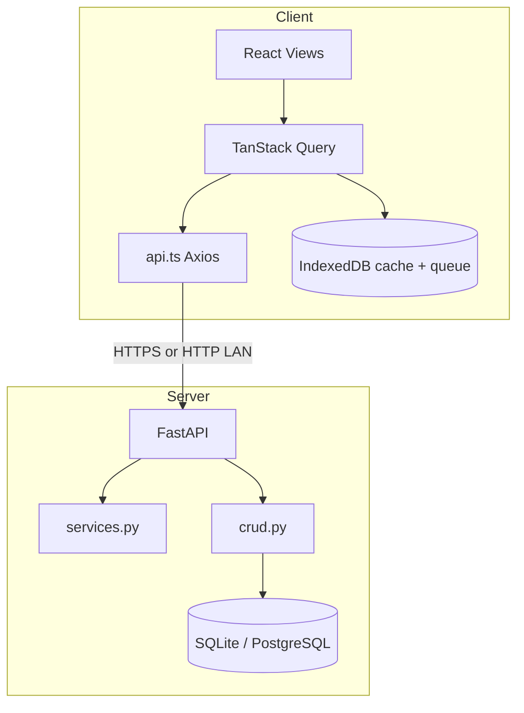

# Architecture

Spendly is a **client–server** app: a React SPA (web + Capacitor Android) talks to a FastAPI backend. All financial data is scoped by `user_id`.

---

## Repository layout

### Backend (`backend/`)

| Path | Role |
|------|------|
| `app/main.py` | App factory, CORS, routers, APScheduler, `/health` |
| `app/services.py` | `calculate_dashboard()`, `run_auto_billing()` |
| `app/crud.py` | Database operations (per `user_id`) |
| `app/models.py` | SQLAlchemy models |
| `app/schemas.py` | Pydantic request/response types |
| `app/auth.py` | JWT, bcrypt, `get_current_user` |
| `app/routers/` | REST route modules |
| `alembic/versions/` | Schema migrations |

### Frontend (`frontend/`)

| Path | Role |
|------|------|
| `src/App.tsx` | Auth gate, tab shell, nav, privacy overlay |
| `src/lib/LogView.tsx` | Expense logging + numpad |
| `src/lib/DashboardView.tsx` | Overview / safe-to-spend |
| `src/lib/HistoryView.tsx` | Transaction history |
| `src/lib/ManageView.tsx` | Settings |
| `src/lib/AuthView.tsx` | Login / register |
| `src/lib/api.ts` | HTTP client + types |
| `src/lib/hooks.ts` | React Query + offline mutations |
| `src/lib/offlineSync.ts` | Cache, queue, sync |
| `src/lib/localDb.ts` | IndexedDB stores |
| `src/lib/SyncProvider.tsx` | Online/offline sync UI trigger |

---

## Request lifecycle (online)

1. User action in a view (e.g. add transaction).
2. `hooks.ts` mutation runs `api.*` or offline fallback.
3. Axios sends `Authorization: Bearer <token>` to `/api/...`.
4. FastAPI `get_current_user` validates JWT (`sub` = username).
5. Router calls `crud.*` with `current_user.id`.
6. On success, React Query invalidates or hydrates from `localDb`.

---

## Budget engine (server)

**Source of truth:** `backend/app/services.py` → `calculate_dashboard()`.

Inputs per user:

- All transactions (amount, category, date, `duration_months`, `is_income`)
- Auto-pay rules (sum of amounts)
- `budget_state`: `monthly_income`, `rollover_amount`, `base_budget` (stored; `base_budget` not used in formula today)

Logic (simplified):

1. **Amortize** non-income expenses over `duration_months` into past/current/future months.
2. **Income** transactions add to current month income.
3. **Auto-Pay** category txs are excluded from amortization (rules handle monthly deduction).
4. **Dynamic rollover** adjusts for past months’ income vs spend vs auto-pays.
5. **Safe to spend** = income + current month income + rollover − auto-pay rules − current month amortized burden.

Exposed as `GET /api/budget/summary` and `GET /api/dashboard`.

---

## Auto-billing

`run_auto_billing()` in `services.py`:

- Runs on server startup, daily cron (00:05), new auto-pay create, and after import.
- For each rule, creates `Auto-Pay` transactions for each month not yet billed.
- Bills past months immediately; current month only after `billing_day`.
- Transactions link via `auto_pay_id`; edits blocked, deletes blocked on auto-billed rows.

---

## Auth

- Register: JSON body → user + seeded categories + JWT.
- Login: OAuth2 form (`username`, `password`) → JWT + user.
- Token: HS256, default 30-day expiry (`ACCESS_TOKEN_EXPIRE_MINUTES`).
- Protected routes require `Authorization: Bearer ...`.

---

## Android (Capacitor)

- Web assets in `frontend/dist` copied to `android/app/src/main/assets`.
- `capacitor.config.json`: `webDir: dist`, `androidScheme: http` for LAN HTTP API during dev.
- Native token storage: `@capacitor/preferences` via `storage.ts`.
- Debug APK: Gradle `assembleDebug` → `app-debug.apk`.

See [INSTALL_DEBUG_APK.md](INSTALL_DEBUG_APK.md) and [OFFLINE.md](OFFLINE.md).

---

## Security notes

- Passwords hashed with bcrypt (not stored plain).
- All financial queries filtered by `user_id`.
- Production: set `SECRET_KEY`, `ENABLE_DOCS=false`, PostgreSQL, HTTPS only.
- CORS must include Capacitor origins (`capacitor://localhost`, `https://localhost`, `http://localhost`).
